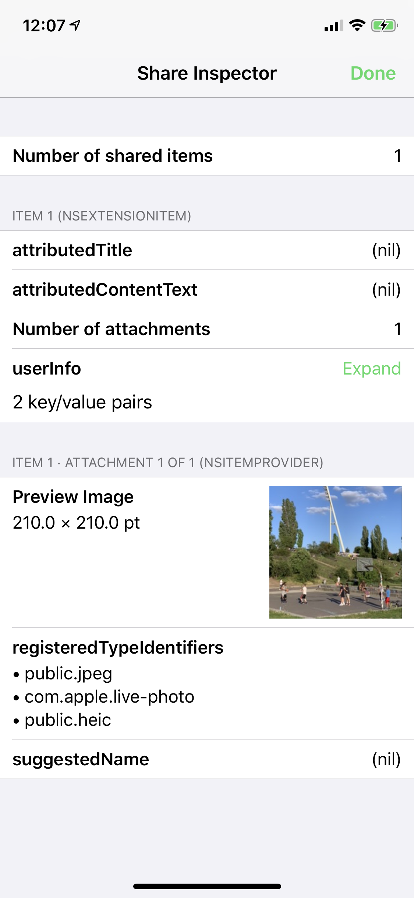
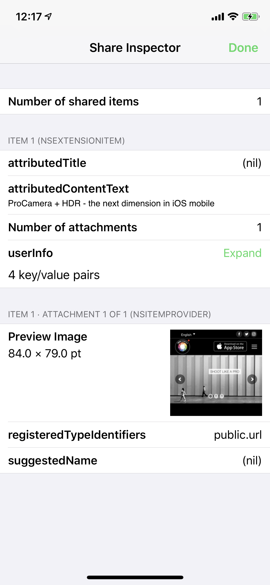

#  Share Inspector

An iOS app that provides a [share extension](https://developer.apple.com/design/human-interface-guidelines/ios/extensions/sharing-and-actions/) for inspecting the data the host app provides via the share sheet.

## Usage

1. Download or clone the repository.
2. Open the project in Xcode and run it on the simulator or an iOS device.
3. Open the share sheet in any app and pick Share Inspector in the share sheet.

## Requirements

iOS 12.0 or later. 
No dependencies.

## Screenshot

Share Inspector receiving a Live Photo shared from Photos: 

Share Inspector receiving a web page shared from Safari: 

